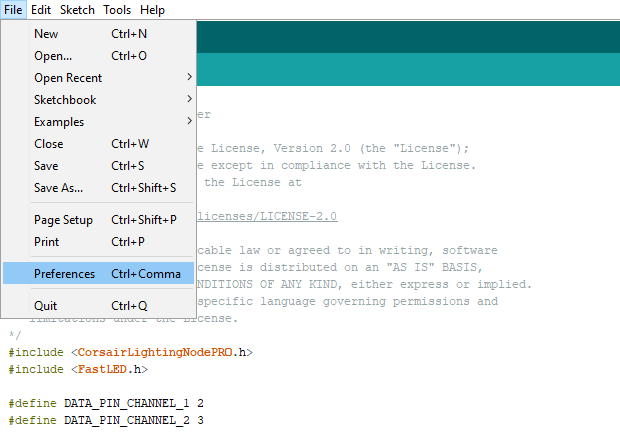
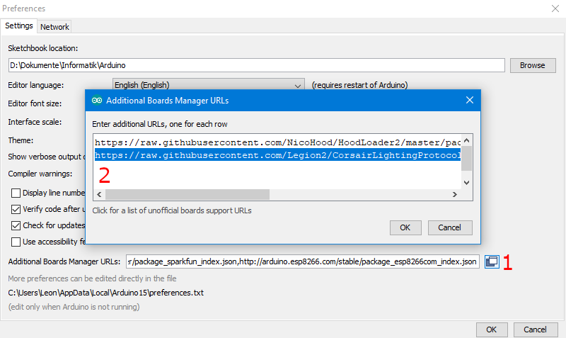
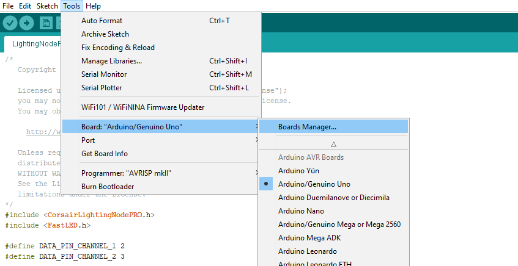
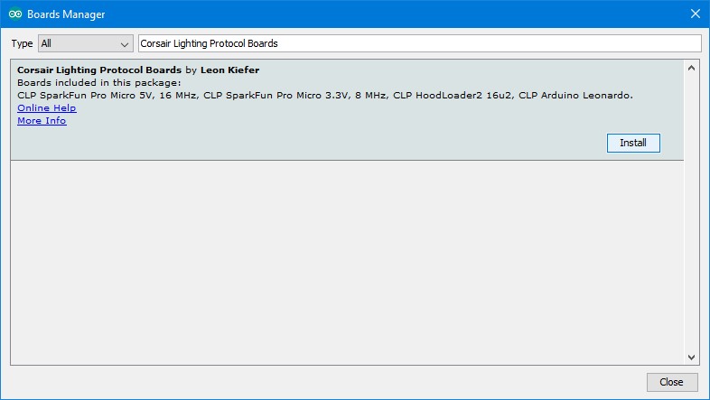
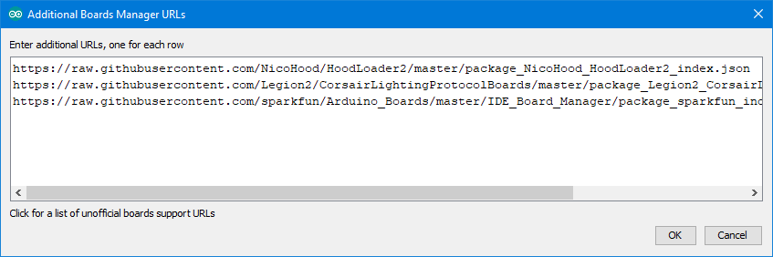
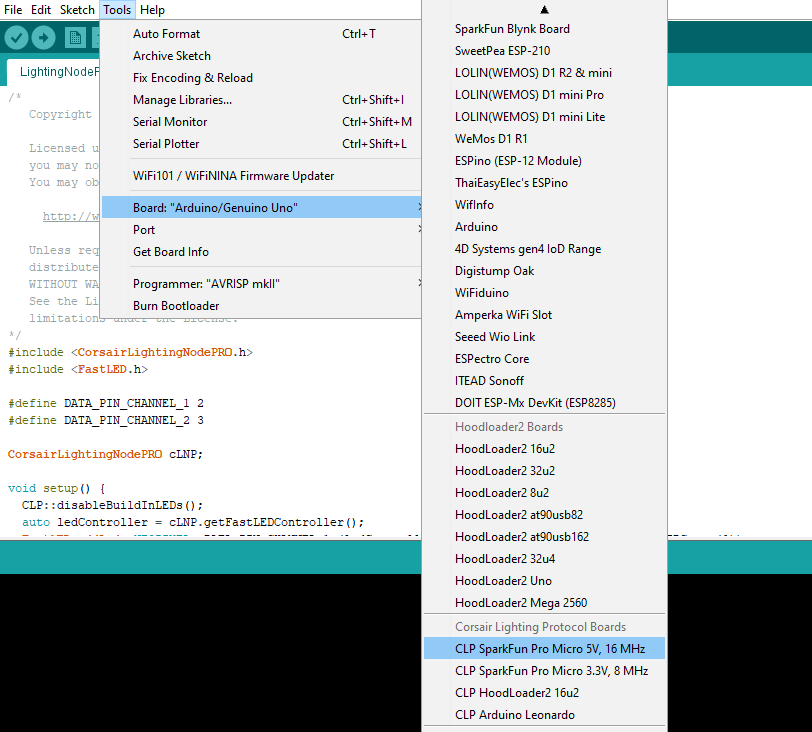
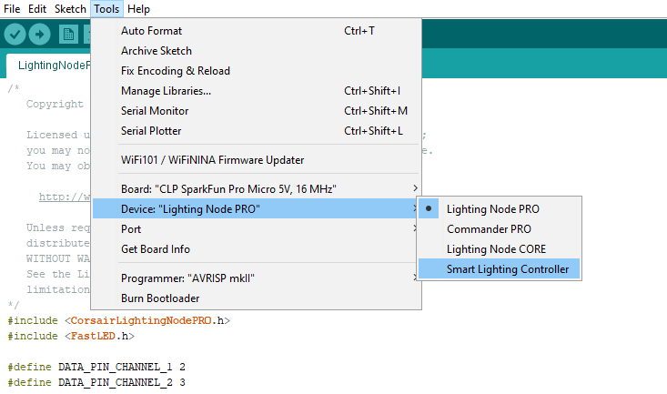
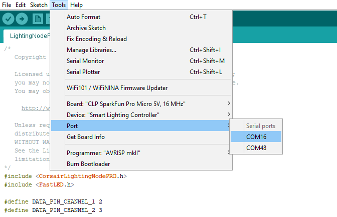

# Corsair Lighting Protocol Boards
Arduino board definitions for use with the [Corsair Lighting Protocol](https://github.com/Legion2/CorsairLightingProtocol) library.
These board definitions have modified USB settings so they can be used to simulate corsair devices.

## Install CLP Boards in Arduino
All boards can simply be installed in Arduino IDE via the Boards Manager.
When using 3rd party boards such as SparkFun you must install them additionally.
See [Supported Hardware Boards](#supported-hardware-boards) down below for more details.

package index URL:
```
https://raw.githubusercontent.com/Legion2/CorsairLightingProtocolBoards/master/package_Legion2_CorsairLightingProtocolBoards_index.json
```

1. Open the **Preferences** of the Arduino IDE.

   
1. Add the package index URL above in the **Additional Boards Manager URLs** field, and click OK.

   
1. Open the **Boards Manager** by opening the menu Tools->Board->Board Manager...

   
1. Search and install **Corsair Lighting Protocol Boards**

   
1. For some of the boards you must install additional defintions: [SparkFun Boards](https://github.com/sparkfun/Arduino_Boards#installation-instructions), [Hoodloader2 Boards](https://github.com/NicoHood/HoodLoader2/wiki/Software-Installation#2-installing-board-definitions).
   Make sure you add the additional board urls each on a new line and don't remove the already existing ones.

   

## How to use these boards in Arduino
The CLP Boards can now be used in Arduino IDE.
The following is only an example on how to use the boards, it's not required for the installation.

1. Select one of the boards under Corsair Lighting Protocol Boards in Tools->Board menu

   
1. Select one of the devices from corsair under Tools->Device

   
1. Select COM port under Tools->Port

   
1. Compile/Upload as usual

## Supported Hardware Boards
| Hardware Board(s)        | Instructions                                                                                                  |
|--------------------------|---------------------------------------------------------------------------------------------------------------|
| Arduino Leonardo         | installed by default                                                                                          |
| SparkFun Pro Micro       | install [SparkFun Boards](https://github.com/sparkfun/Arduino_Boards#installation-instructions)               |
| Adafruit 32u4 AVR Boards | install [Adafruit AVR Boards](https://learn.adafruit.com/adafruit-feather-32u4-basic-proto/arduino-ide-setup) |

## How to release a new version (development)

1. Update the version in `avr/platform.txt`, commit and push the changes.
1. On GitHub create a new Release for the version.
1. Wait for the [Release GitHub Action](https://github.com/Legion2/CorsairLightingProtocolBoards/actions?query=workflow%3ARelease) to complete.
1. Add the new version to the package index file by using the infos provided by the Release GitHub Action.
   Commit and push these changes.

## License
This project is licensed under the Apache License Version 2.0.
